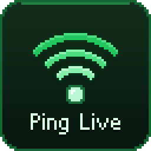
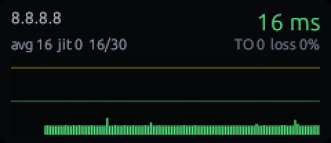
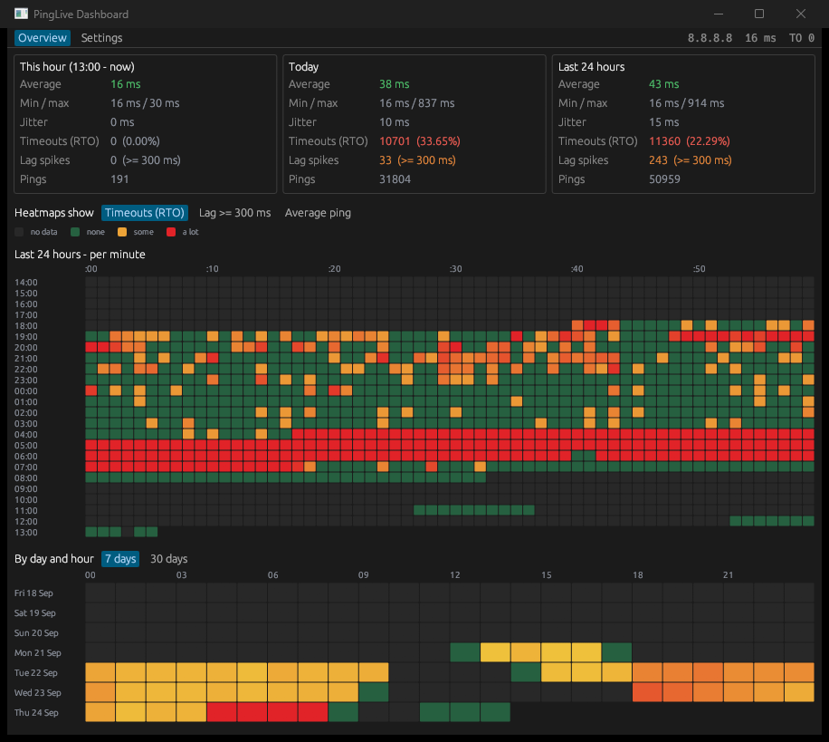
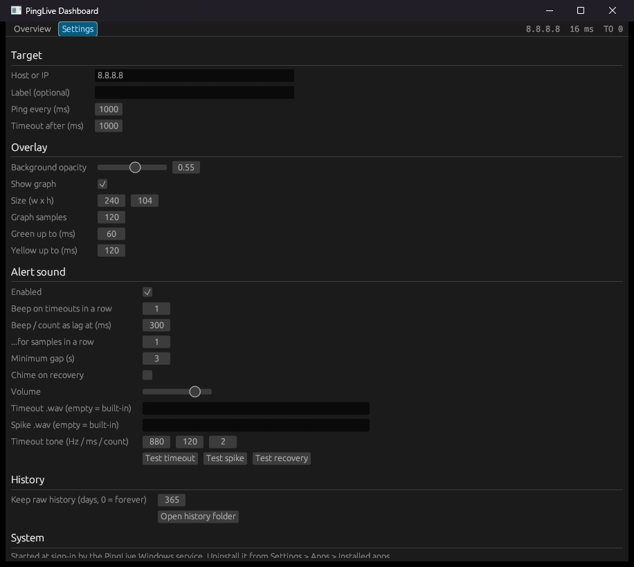

<p align="center">
  
</p>

<h1 align="center">PingLive</h1>

<p align="center">
  A tiny always-on-top ping monitor for Windows: live latency, a rolling graph,<br>
  a timeout counter, and an alert sound on every timeout or ping spike.
</p>

<p align="center">
  <a href="https://github.com/dh3niel/pinglive/actions/workflows/build.yml"></a>
  <a href="https://github.com/dh3niel/pinglive/releases/latest"></a>
  <a href="LICENSE"></a>
  
</p>

<p align="center">
  
</p>

For anyone who needs to keep an eye on their connection: gamers chasing lag
spikes, people on video calls or streams, or anyone trying to prove to their
ISP *when* the line drops. PingLive sits in a corner of the screen, always on
top and click-through, so you can keep working or playing. It beeps the
moment a request times out or the ping spikes, and it keeps a full history so
you can see when your connection usually goes bad. Written in Rust, it's a
single ~4 MB exe with negligible CPU/GPU cost.

## Quick start

1. Download `pinglive-vX.Y.Z-windows-x64.zip` from the
   [latest release](https://github.com/dh3niel/pinglive/releases/latest) and unzip it.
2. Run `pinglive.exe` to try it; the overlay appears in the top-left corner.
   Press `Ctrl+Alt+P` to drag it, `Ctrl+Alt+D` for the dashboard.
3. To keep it running, install it as a Windows service (asks for admin once):

   ```bash
   pinglive.exe --install
   ```

   It then starts at every sign-in, restarts itself if it crashes, and shows
   up in **Settings → Apps → Installed apps**, where you can uninstall it.
   See [Install as a Windows service](#install-as-a-windows-service).

## Screenshots

| Dashboard: history and heatmaps | Settings |
| --- | --- |
|  |  |

## What it does

- **Live ping** to any host or IP (default `8.8.8.8`) using Windows ICMP —
  no admin rights needed.
- **Rolling bar graph** of the last N samples, colour-coded green / yellow /
  red against your own thresholds. Timeouts are drawn as full-height red bars,
  so a packet-loss burst is visible at a glance.
- **Stats**: current, average, min/max, jitter, loss %, and a running
  **timeout counter** since start.
- **Sound alerts**, each with its own sound so you can tell them apart
  without looking:
  - **Request timeout (RTO):** a descending two-tone alarm.
  - **Ping spike** (≥ 300 ms by default): a quick rising double blip.
  - **Recovery** (optional): a short chime when replies come back.

  The sounds are generated in memory and play through your normal audio
  device, at a volume you set. You can also use your own `.wav` for timeouts
  and spikes. Alerts are rate-limited by `cooldown_secs`.
- **Click-through by default** — the mouse goes straight to the game.
- **Global hotkeys** work even while a game or another app has focus.
- **Full ping history on disk** — every sample, kept for `retention_days`.
- **Dashboard** — this hour / today / last 24 h, a per-minute heatmap of the
  last 24 hours, a day × hour heatmap for 7 or 30 days, a time-of-day profile
  ("when does it usually happen") and the worst minutes. Each heatmap can show
  timeouts (RTO), lag (≥ 300 ms) or average ping; hover any cell for details.
- **Settings** in the dashboard — target, interval, alerts, sound, colours,
  history, *Start with Windows*.
- **Tray icon** — a dot coloured by the live ping, with the reading in its
  tooltip. Double-click brings a hidden overlay back; right-click for
  Dashboard / Show overlay / Settings / Mute / Exit.

## Build from source

Requires the Rust toolchain (MSVC) with a C linker:

```bash
winget install --id Rustlang.Rustup -e --scope user
```

Then, in the project folder:

```bash
cargo build --release
```

The binary lands at `target\release\pinglive.exe` (no console window).

The icon (`assets/pinglive.ico`, pixel art drawn by `scripts/make-icon.py`)
and the version info (product, publisher from `authors` in `Cargo.toml`,
version, copyright) are embedded into the exe by `build.rs`, so they show in
Explorer, the file's Properties > Details and Installed apps. After changing
the icon script, run `python scripts/make-icon.py` and rebuild.

## Run

```bash
cargo run --release -- --target 8.8.8.8
```

First launch writes a config file at `%APPDATA%\PingLive\config.toml` and
remembers the window position from then on.

CLI flags override the config for that run and are saved back:
`--target <host>`, `--interval <ms>`, `--timeout <ms>`, `--show`
(start in interactive mode so you can drag it).

## Hotkeys (global — work inside the game)

| Keys | Action |
| --- | --- |
| `Ctrl+Alt+P` | Toggle interactive mode — a blue border appears, drag the overlay anywhere, **double-click it to open the dashboard**, press again to make it click-through |
| `Ctrl+Alt+D` | Open / close the dashboard |
| `Ctrl+Alt+M` | Mute / unmute the alerts |
| `Ctrl+Alt+G` | Toggle the graph (compact one-line mode) |
| `Ctrl+Alt+H` | Hide the overlay to the tray / show it again |
| `Ctrl+Alt+R` | Reset the stats and the timeout counter |
| `Ctrl+Alt+Q` | Quit |

## Config — `%APPDATA%\PingLive\config.toml`

```toml
target = "8.8.8.8"      # host or IP: your router, DNS, a game server...
label = ""              # short name to display instead of the target
interval_ms = 1000      # how often to ping
timeout_ms = 1000       # no reply within this = timeout
history = 120           # samples kept in the graph
retention_days = 365    # days of raw history kept on disk, 0 = forever

[window]
x = 40.0
y = 40.0
width = 240.0
height = 104.0
opacity = 0.45          # 0.0 invisible .. 1.0 solid background
click_through = true
always_on_top = true
show_graph = true
visible = true          # false = hidden to the tray (remembered across restarts)

[alert]
enabled = true
timeout_streak = 1      # consecutive timeouts before the sound fires
cooldown_secs = 3       # minimum gap between alerts
recovery_sound = false    # no chime on recovery; beep only for the two cases below
high_ping_ms = 300      # beep as soon as a ping reaches this...
high_ping_streak = 1    # ...on the very first sample that does
volume = 0.8            # built-in sounds, 0.0 .. 1.0
sound_file = ""         # .wav for timeouts, or empty for the built-in alarm
spike_sound_file = ""   # .wav for ping spikes, or empty for the built-in blip
beep_freq_hz = 880      # built-in timeout alarm: first tone, length, count
beep_ms = 120
beep_count = 2

[colors]
good_ms = 60            # <= green
warn_ms = 120           # <= yellow, above = red
```

Restart the overlay after editing `target`, `interval_ms` or `timeout_ms`.

### Custom alert sounds

```toml
[alert]
sound_file = "C:\\Sounds\\connection-lost.wav"
spike_sound_file = "C:\\Sounds\\lag.wav"
```

Each must be a `.wav` file, and it plays on a background thread so it never
stalls the overlay. Leave them empty for the built-in sounds, which need no
audio file. **Settings → Alert sound** has *Test timeout*, *Test spike* and
*Test recovery* buttons to hear them.

## What to ping

- **`8.8.8.8`** (the default) or **`1.1.1.1`** tells you whether *your
  internet line* is healthy, which is usually what you want when looking for
  the cause of lag.
- **Your router** (e.g. `192.168.1.1`) separates Wi-Fi/LAN trouble from ISP
  trouble: if the router times out too, the problem is inside your home.
- **A game server** shows the route to that server. For Dota 2 there is a
  helper that lists the servers the game is talking to while you're in a match:

  ```bash
  powershell -ExecutionPolicy Bypass -File scripts\dota-server-ip.ps1
  ```

  Many game relays deprioritise or drop ICMP, so the number can read higher
  than the in-game ping. Treat the *shape* of the graph as the signal, not
  the absolute value.

## Ping history

Stored in `%APPDATA%\PingLive\history\YYYY-MM-DD.bin`, one file per local day,
6 bytes per ping: `u32` LE unix seconds + `u16` LE round trip in ms
(`0xFFFF` = timeout, `0xFFFE` = name did not resolve) — about 0.5 MB a day at
one ping a second. Writes are batched every 30 s. The last 31 days are folded
into per-minute buckets at startup, which is all the dashboard ever reads.
Changing the target keeps writing to the same files, so the history is
"whatever you were pinging at the time".

## Install as a Windows service

```bash
target\release\pinglive.exe --install
```

This asks for administrator rights once, then:

- copies the exe to `C:\Program Files\PingLive\pinglive.exe`;
- registers an auto-start **PingLive** service ("PingLive Ping Overlay" in
  `services.msc`) that the Service Control Manager also restarts if it fails;
- adds **PingLive** to **Settings → Apps → Installed apps** (and the old
  *Programs and Features*), with a working **Uninstall** button;
- turns off the per-user *Start with Windows* entry, since the service does
  that job now, and starts the service.

A service runs in session 0 and can never draw on your desktop, so the
service does not show the overlay itself. It supervises it: at every sign-in
it starts `pinglive.exe` in your session, as you, and restarts it if it
crashes (up to 5 times in 10 minutes). If you quit the overlay yourself
(`Ctrl+Alt+Q` or the tray) it stays closed until the next sign-in — start it
from the exe again or restart the service. Stopping the service closes the
overlay cleanly, with its history flushed.

Running `--install` again with a newer build upgrades in place. To remove it,
use **Uninstall** in Installed apps, or:

```bash
"C:\Program Files\PingLive\pinglive.exe" --uninstall
```

That stops and deletes the service, the Installed-apps entry and the Program
Files folder. Your settings and ping history in `%APPDATA%\PingLive` are kept.

### Without admin rights

Tick **Settings → Start PingLive when I sign in to Windows** (a per-user `Run`
entry), or register a logon **Scheduled Task**, which also restarts the app if
it crashes:

```bash
powershell -ExecutionPolicy Bypass -File scripts\install-autostart.ps1
```

Remove it again with:

```bash
powershell -ExecutionPolicy Bypass -File scripts\uninstall-autostart.ps1
```

The app takes a named mutex, so a second copy started by hand exits
immediately instead of stacking a second overlay on screen.

## Fullscreen games

Overlays can only be drawn over a game running in **Windowed** or **Borderless
Window** mode (usually under the game's video or display settings). In
exclusive **Fullscreen**,
Windows gives the game the whole swap chain and no top-most window shows
through — this is the same limitation the Discord and Steam overlays have.

## Notes

- Windows ICMP reports RTT in whole milliseconds, so sub-millisecond LAN
  latencies show as `0 ms`.
- CPU/GPU cost is negligible: vsync is off, the UI only repaints a few times
  a second, and nothing is drawn while the overlay is hidden.
- If a hotkey is already owned by another app, it is skipped with a message on
  stderr and the rest still register.
- `ViewportBuilder::with_decorations(false)` is ignored by the winit build that
  eframe 0.29 pulls in on Windows 11 - the window keeps `WS_CAPTION` and DWM
  paints a title bar over the readout. `src/win.rs` converts the window to a
  `WS_POPUP` overlay after the first frames and then nudges the size by a pixel
  and back, which is what makes the GL surface reconfigure; without that nudge
  the window renders black.

## License

[MIT](LICENSE): free to use, copy, change, share and build on, as long as
the copyright notice and license stay with the code. Provided as is, with no
warranty.
